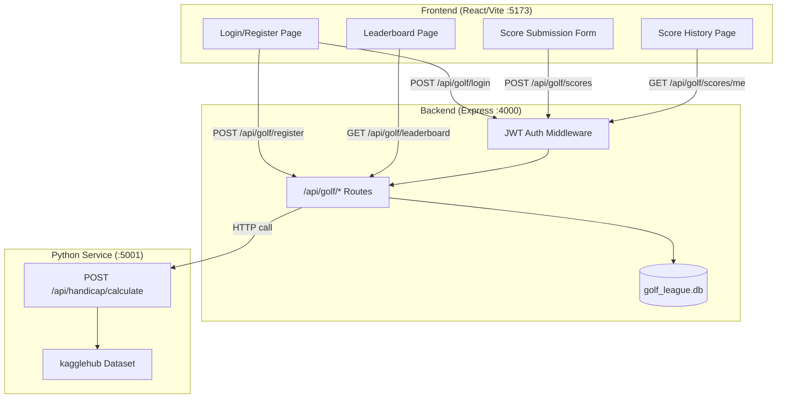

# Design Document: Golf League Handicap Tracker

## Overview

The Golf League Handicap Tracker extends the existing ShopMart application with a self-contained golf league management module. It provides user registration (capped at 50 members), JWT-based authentication with role-based access control, score submission with one-per-day enforcement, admin-only score editing, a sorted leaderboard, automatic USGA handicap calculation via a Python microservice, and player score history.

The system is composed of three layers:
1. **Backend API** — New Express routes under `/api/golf/*` using a separate SQLite database (`golf_league.db`)
2. **Python Handicap Service** — A Flask microservice at `/api/handicap/calculate` implementing the USGA differential formula
3. **Frontend SPA** — New React pages/components integrated into the existing hash-based router

### Key Design Decisions

- **Separate database**: The golf league uses its own SQLite file (`backend/data/golf_league.db`) to avoid coupling with the ShopMart product database.
- **Synchronous handicap trigger**: When a score is created/updated, the backend calls the Python service synchronously before responding. This keeps the handicap always consistent with scores.
- **JWT in Authorization header**: Standard Bearer token pattern, decoded via middleware on protected routes.
- **Python microservice**: Runs on a separate port (5001) and is called internally by the Node backend. The Vite proxy does not expose it directly to the frontend.

---

## Architecture



### Request Flow

1. Frontend sends requests to `/api/golf/*` (proxied to `:4000` by Vite in dev)
2. Express routes check JWT via `authMiddleware` for protected endpoints
3. Route handlers interact with `golf_league.db` via `better-sqlite3`
4. On score create/update, the backend POSTs to `http://localhost:5001/api/handicap/calculate` with the player's score history
5. The Python service computes the handicap and returns it; the backend stores the result in the `handicaps` table

---

## Components and Interfaces

### Backend Components

#### 1. Golf Database Module (`backend/src/db/golfDatabase.js`)

Separate database connection for the golf league, following the same pattern as the existing `database.js`.

```javascript
// Exports: golfDb (better-sqlite3 instance)
// - Connects to backend/data/golf_league.db
// - Enables WAL mode and foreign keys
// - Applies golf schema on startup
```

#### 2. Auth Middleware (`backend/src/middleware/golfAuth.js`)

JWT verification middleware for protected golf routes.

```javascript
// Exports:
//   authMiddleware(req, res, next) — verifies JWT, attaches req.user = { id, role }
//   adminMiddleware(req, res, next) — checks req.user.role === 'admin'
```

#### 3. Golf Auth Routes (`backend/src/routes/golfAuth.js`)

Handles registration and login.

| Endpoint | Method | Auth | Description |
|----------|--------|------|-------------|
| `/api/golf/register` | POST | None | Register new player |
| `/api/golf/login` | POST | None | Authenticate and return JWT |

#### 4. Golf Score Routes (`backend/src/routes/golfScores.js`)

Handles score CRUD and leaderboard.

| Endpoint | Method | Auth | Description |
|----------|--------|------|-------------|
| `/api/golf/scores` | POST | Player/Admin | Submit a score |
| `/api/golf/scores/:id` | PUT | Admin only | Edit a score |
| `/api/golf/scores/me` | GET | Player/Admin | Get own score history |
| `/api/golf/leaderboard` | GET | None | Get sorted leaderboard |

#### 5. Handicap Client (`backend/src/services/handicapClient.js`)

HTTP client that calls the Python handicap service.

```javascript
// Exports:
//   calculateHandicap(scores, courseRating, slopeRating) → Promise<{ handicap_index: number | null }>
```

### Python Service Components

#### 6. Handicap Calculator (`golf-handicap/app.py`)

Flask application exposing the calculation endpoint.

| Endpoint | Method | Description |
|----------|--------|-------------|
| `/api/handicap/calculate` | POST | Calculate handicap index |
| `/api/handicap/health` | GET | Health check |

**Input schema:**
```json
{
  "scores": [85, 90, 88, ...],
  "course_rating": 72.1,
  "slope_rating": 131
}
```

**Output schema:**
```json
{
  "handicap_index": 14.3,
  "differentials_used": 8,
  "message": null
}
```

### Frontend Components

#### 7. Golf API Module (`frontend/src/api/golfApi.js`)

Thin fetch wrappers for all golf endpoints. Attaches JWT from localStorage.

#### 8. Auth Pages (`frontend/src/pages/GolfLoginPage.jsx`, `GolfRegisterPage.jsx`)

Login and registration forms. On success, stores JWT and navigates to leaderboard.

#### 9. Leaderboard Page (`frontend/src/pages/GolfLeaderboardPage.jsx`)

Table displaying all players sorted by handicap. Includes manual refresh button.

#### 10. Score History Page (`frontend/src/pages/GolfScoreHistoryPage.jsx`)

Player's own scores in descending date order. Admin sees edit buttons.

#### 11. Score Submission Component (`frontend/src/components/GolfScoreForm.jsx`)

Form for submitting a new score with date picker and score input.

#### 12. Golf Layout/Nav (`frontend/src/components/GolfNav.jsx`)

Navigation bar for the golf section with links to leaderboard, submit score, history, and logout.

---

## Data Models

### SQLite Schema (`backend/src/db/golfSchema.sql`)

```sql
-- Players table
CREATE TABLE IF NOT EXISTS players (
  id            INTEGER PRIMARY KEY AUTOINCREMENT,
  username      TEXT    NOT NULL UNIQUE,
  password_hash TEXT    NOT NULL,
  role          TEXT    NOT NULL DEFAULT 'player' CHECK(role IN ('player', 'admin')),
  created_at    TEXT    NOT NULL DEFAULT (datetime('now'))
);

-- Scores table
CREATE TABLE IF NOT EXISTS scores (
  id          INTEGER PRIMARY KEY AUTOINCREMENT,
  player_id   INTEGER NOT NULL REFERENCES players(id),
  score       INTEGER NOT NULL CHECK(score BETWEEN 50 AND 150),
  date_played TEXT    NOT NULL,
  created_at  TEXT    NOT NULL DEFAULT (datetime('now')),
  UNIQUE(player_id, date_played)
);

-- Handicaps table (latest handicap per player)
CREATE TABLE IF NOT EXISTS handicaps (
  id             INTEGER PRIMARY KEY AUTOINCREMENT,
  player_id      INTEGER NOT NULL REFERENCES players(id),
  handicap_index REAL,
  updated_at     TEXT    NOT NULL DEFAULT (datetime('now'))
);

CREATE INDEX IF NOT EXISTS idx_scores_player ON scores(player_id);
CREATE INDEX IF NOT EXISTS idx_scores_player_date ON scores(player_id, date_played);
CREATE INDEX IF NOT EXISTS idx_handicaps_player ON handicaps(player_id);
```

### JWT Payload Structure

```json
{
  "id": 1,
  "role": "player",
  "iat": 1700000000,
  "exp": 1700086400
}
```

### USGA Handicap Lookup Table

The Python service uses this lookup table to determine how many differentials to average:

| Scores Available | Differentials Used | Adjustment |
|------------------|--------------------|------------|
| 3 | Lowest 1 | -2.0 |
| 4 | Lowest 1 | -1.0 |
| 5 | Lowest 1 | 0 |
| 6 | Lowest 2 | -1.0 |
| 7–8 | Lowest 2 | 0 |
| 9–11 | Lowest 3 | 0 |
| 12–14 | Lowest 4 | 0 |
| 15–16 | Lowest 5 | 0 |
| 17–18 | Lowest 6 | 0 |
| 19 | Lowest 7 | 0 |
| 20+ | Lowest 8 | 0 |

**Formula:** `differential = (score - course_rating) × 113 / slope_rating`
**Handicap Index:** `average(best N differentials) + adjustment`

### Default Course Data

The Python service loads course rating and slope rating from the kagglehub dataset (`fletcherkennamer/grandpa-golf`). If the dataset is unavailable, it falls back to standard defaults: `course_rating = 72.0`, `slope_rating = 113`.

---

## Correctness Properties

*A property is a characteristic or behavior that should hold true across all valid executions of a system—essentially, a formal statement about what the system should do. Properties serve as the bridge between human-readable specifications and machine-verifiable correctness guarantees.*

### Property 1: Valid registration creates a player

*For any* valid username (≥3 characters) and valid password (≥6 characters) where the username does not already exist and the league has fewer than 50 members, registering should return HTTP 201 with the player's `id` and `username`, and the player should be retrievable from the database.

**Validates: Requirements 1.2**

### Property 2: Duplicate username registration is rejected

*For any* valid username, if a player with that username already exists, a subsequent registration attempt with the same username should return HTTP 409 regardless of the password provided.

**Validates: Requirements 1.3**

### Property 3: Invalid registration input is rejected

*For any* username shorter than 3 characters (including empty/missing) or any password shorter than 6 characters (including empty/missing), the registration endpoint should return HTTP 400 and no player record should be created.

**Validates: Requirements 1.4, 1.5**

### Property 4: Passwords are never stored in plain text

*For any* registered player, the stored `password_hash` value in the database should be a valid bcrypt hash and should never equal the original plain-text password.

**Validates: Requirements 1.6**

### Property 5: Valid credentials produce a correct JWT

*For any* registered player who logs in with correct credentials, the response should contain a valid JWT whose payload includes the player's `id`, `role`, and an `exp` claim approximately 24 hours after `iat`.

**Validates: Requirements 2.2, 2.5, 2.6**

### Property 6: Invalid credentials are rejected

*For any* login attempt where either the username does not exist or the password does not match the stored hash, the endpoint should return HTTP 401 with `{ "error": "Invalid credentials" }`.

**Validates: Requirements 2.3, 2.4**

### Property 7: Protected endpoints reject unauthenticated requests

*For any* protected endpoint (POST /api/golf/scores, PUT /api/golf/scores/:id, GET /api/golf/scores/me), a request without a valid JWT in the Authorization header should return HTTP 401.

**Validates: Requirements 3.2, 3.3**

### Property 8: Player role cannot access admin endpoints

*For any* authenticated user with role "player", a request to an admin-only endpoint (PUT /api/golf/scores/:id) should return HTTP 403 regardless of the request body content.

**Validates: Requirements 3.4, 5.3**

### Property 9: Valid score submission creates an entry

*For any* authenticated player, valid score (integer 50–150), and valid ISO 8601 date not already used by that player, submitting a score should return HTTP 201 and the created entry should be linked to the authenticated player's ID.

**Validates: Requirements 4.2, 4.3**

### Property 10: Duplicate date score submission is rejected

*For any* player and date, if a score already exists for that (player, date) combination, a subsequent submission for the same date should return HTTP 409 and the original score should remain unchanged.

**Validates: Requirements 4.4, 10.5**

### Property 11: Invalid score values are rejected

*For any* score value that is not an integer or falls outside the range 50–150, and for any missing or invalid ISO 8601 date string, the score submission endpoint should return HTTP 400 and no score record should be created.

**Validates: Requirements 4.5, 4.6**

### Property 12: Handicap differential formula correctness

*For any* valid score (integer), course_rating (positive real), and slope_rating (positive real), the computed differential should equal `(score - course_rating) × 113 / slope_rating`, rounded to the nearest tenth.

**Validates: Requirements 7.4**

### Property 13: Handicap uses correct number of differentials per USGA table

*For any* set of N scores where 3 ≤ N ≤ 20, the handicap calculation should use exactly the number of lowest differentials specified by the USGA lookup table and apply the correct adjustment factor. For N ≥ 20, it should use the best 8 differentials with no adjustment.

**Validates: Requirements 7.5, 7.6**

### Property 14: Leaderboard completeness and sorting

*For any* set of registered players (with or without scores), the leaderboard endpoint should return all players with their username, most recent score, date_played, and handicap_index, sorted by handicap_index in ascending order (nulls last).

**Validates: Requirements 6.1, 6.2, 6.3**

### Property 15: Score history returns correct ordered entries

*For any* authenticated player with submitted scores, the GET /api/golf/scores/me endpoint should return all of that player's scores ordered by date_played descending, each containing id, score, date_played, and created_at fields.

**Validates: Requirements 8.1, 8.2**

---

## Error Handling

### Backend Error Strategy

All route handlers use try/catch blocks with consistent JSON error responses:

```javascript
// Standard error response format
{ "error": "Human-readable error message" }
```

| Scenario | HTTP Status | Error Message |
|----------|-------------|---------------|
| Missing/invalid JWT | 401 | "Authentication required" |
| Player accessing admin endpoint | 403 | "Admin access required" |
| League full (50 members) | 403 | "League is full" |
| Duplicate username | 409 | "Username already exists" |
| Duplicate score for date | 409 | "Score already submitted for this date" |
| Validation failure | 400 | Descriptive message per field |
| Score not found | 404 | "Score not found" |
| Invalid credentials | 401 | "Invalid credentials" |
| Python service unavailable | 503 | "Handicap service unavailable" |
| Unexpected server error | 500 | "Internal server error" |

### Python Service Error Handling

- Returns HTTP 400 for invalid input (missing fields, wrong types)
- Returns HTTP 200 with `handicap_index: null` and a `message` when fewer than 3 scores provided
- Catches kagglehub download failures and falls back to default course data
- Returns HTTP 500 for unexpected errors with a JSON error body

### Frontend Error Handling

- API errors display the `error` field from the response body below the relevant form
- Network errors display a generic "Unable to connect to server" message
- JWT expiration triggers automatic redirect to login page
- Loading states shown during API calls to prevent double-submission

---

## Testing Strategy

### Unit Tests (Example-Based)

Unit tests cover specific scenarios, edge cases, and integration points:

- **Registration edge cases**: League full (50 members), exact boundary lengths for username/password
- **Score not found**: Admin editing non-existent score ID returns 404
- **No DELETE endpoint**: Verify DELETE requests to score endpoints return 404/405
- **Leaderboard with no-score players**: Players without scores show null values
- **Fewer than 3 scores**: Handicap returns null with message
- **Frontend rendering**: Login form elements, leaderboard table columns, role-based UI controls

### Property-Based Tests

Property-based tests verify universal correctness properties using randomized inputs. The project will use **fast-check** for JavaScript/Node.js property tests and **Hypothesis** for Python property tests.

**Configuration:**
- Minimum 100 iterations per property test
- Each test tagged with: `Feature: golf-league-handicap-tracker, Property {N}: {title}`

**JavaScript (fast-check) properties:**
- Properties 1–11, 14–15: Registration, authentication, authorization, score submission, leaderboard, score history
- Tests run against the Express routes using supertest with an in-memory test database

**Python (Hypothesis) properties:**
- Properties 12–13: Handicap differential formula, USGA lookup table logic
- Tests run against the calculation functions directly (pure functions)

### Integration Tests

- Score submission triggers handicap recalculation (end-to-end flow)
- Admin score edit triggers handicap recalculation
- Python service health check and connectivity from Node backend
- Full registration → login → submit score → view leaderboard flow

### Test Infrastructure

- **Backend**: Jest + supertest with a separate test SQLite database (`:memory:` or temp file)
- **Python**: pytest + Hypothesis with the calculation module imported directly
- **Frontend**: Vitest + React Testing Library for component tests
- **Dependencies to add**: `jsonwebtoken`, `bcrypt` (backend); `fast-check`, `jest`, `supertest` (dev); `flask`, `hypothesis`, `pytest` (Python dev)
